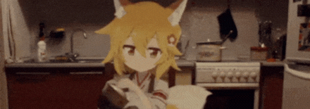

<h1> Hello 👋 </h1>

    

<h2> About Me </h2>

 I'm currently studying IT at <b><a href="https://www.hcmus.edu.vn/">University of Science - VNUHCM</a></b> &nbsp; 

 I know my code sucks &nbsp; 

 Some random stuff at <b><a href="https://takai.github.io">takai.is-a.dev</a> &nbsp;</b> 

<h2> My Skills </h2>

 I know a little bit about front-end but I haven't specialized in any major yet. 

<h2> Stats </h2>

    

<h2> How to Reach Me </h2>
<ul>
    <li> Email: <a href="takai1124@proton.me">takai1124@proton.me</a> </li>
    <li> Discord: <a href="https://lanyard.cnrad.dev/api/800173074166710282">cc.7z</a></li>
</ul>

> [!IMPORTANT]
> 