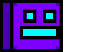

## Hello 👋

<p align="center">
  
</p>

<p> <i> IT major at <a href="https://www.hcmus.edu.vn/">University of Science - VNUHCM</a>  </i> </p>

<p> <i> Night time programmer.  </i> </p>

```javascript
const cc4dev = {
    pronoun: "he" | "him",
    code: ["C++", "Python", "HTML", "CSS", "JavaScript"],
    skill: {
        problemSolving: "decent",
        frontEnd: "not so bad",
    },
    codePlatform: {
        leetcode: "ccaoishere",
        hackerrank: "ccaoishere"
    },
    contact: {
        email: "cc4dev@proton.me",
        discord: null
    },
    funFact: "Although I'm a night time programmer, I'm not a coffee person."
};
```

<p align="center">
    
</p>

<p align="center"> Thanks for visiting! 😊 </p>

> [!IMPORTANT]
> 